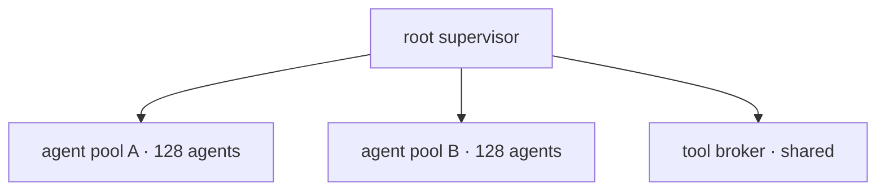

When an agent orchestrator needs to be both fast and crash-only, Rust is the right
tool. We host hundreds of long-lived agents in a single binary. Here's the topology.

## Actors all the way down

Each agent is an actor: its own mailbox, its own state, no shared mutable memory. The
orchestrator is a supervision tree that spawns, watches, and restarts them.



## The tool-invocation protocol

Agents don't call tools directly. They send a typed request to a broker that handles
rate limits, retries, and timeouts — so a misbehaving tool can't take an agent down.

```rust
enum ToolCall {
    Search { query: String },
    Fetch  { url: String },
    Write  { path: PathBuf, body: Bytes },
}

// agent → broker → tool, with the broker owning all the failure handling
async fn invoke(broker: &Broker, call: ToolCall) -> Result<ToolResult> {
    broker.submit(call).timeout(Duration::from_secs(30)).await?
}
```

## Crash-only by design

An agent that hits an unrecoverable state doesn't try to limp along. It panics, the
supervisor catches it, restores the last checkpoint, and restarts. Recovery is the
*normal* path, not the exception.

- **Isolation** — one agent's panic never touches another's state
- **Supervision** — restarts are policy, not heroics
- **Backpressure** — the broker bounds tool concurrency globally

:::warn Don't share state between agents
The moment two agents share a mutable structure, you've traded the actor model's
guarantees for a debugging nightmare. Pass messages. Always.
:::

> A single Rust binary now hosts what used to be a fleet of Python workers. It uses a
> tenth of the memory and has not fallen over in production once.
