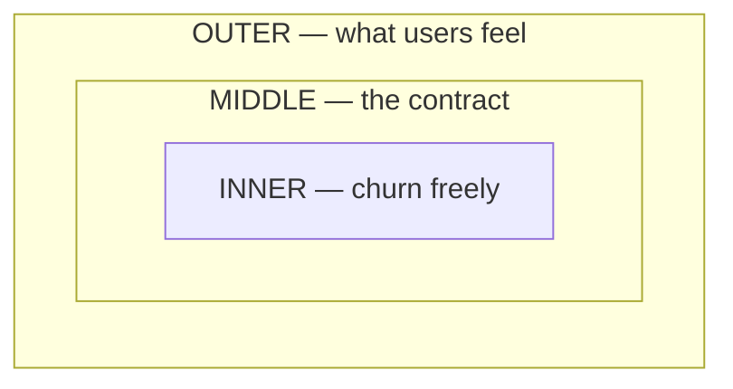

The best infrastructure is the one you never think about. Nobody praises the
electrical grid when the lights come on — they only notice it when the room goes
dark. After a decade of building systems for payments and high-throughput data, I've
come to believe that *invisibility is the highest compliment* a platform can earn.

## What "invisible" actually means

Invisible does not mean undocumented, magical, or unowned. It means the system
behaves so predictably that the people building on top of it stop modelling its
failure modes in their heads. They trust it the way you trust the floor.

- **Predictable latency** — p99 that doesn't wander
- **Boring failure modes** — fails the same way every time
- **Zero surprise capacity** — it degrades gracefully, never cliff-edges
- **No tribal knowledge** — the runbook is the code

> A platform team's win condition is being forgotten about. If product engineers
> are talking about your service, something is on fire.

## The cost of visible infrastructure

Every time a downstream team has to reason about your retries, your backpressure, or
your "occasionally the cache is stale for 40 seconds," you've leaked complexity. That
leak compounds. Ten teams each carrying a 2% tax on every feature is a 20% tax on the
whole org.

```rust
// The interface should hide the machinery completely.
// Callers never see the pool, the retries, or the circuit breaker.
pub async fn charge(account: AccountId, cents: u64) -> Result<Receipt> {
    let txn = ledger.begin(account).await?;   // pooled, retried, traced
    txn.debit(cents)?;
    txn.commit().await                         // idempotent on the caller's key
}
```

The caller sees four lines. Behind them sit a connection pool, an idempotency table,
a circuit breaker, and a distributed trace — none of which they should ever have to
think about.

## A mental model for boundaries

I draw every platform as three concentric rings. The inner ring is yours to break.
The middle ring is your contract. The outer ring is what users actually feel.



:::note Rule of thumb
If a change touches the **middle ring**, it needs a migration plan. If it only touches
the **inner ring**, ship it on a Friday and nobody will notice. That's the goal.
:::

## Closing

Build the thing that disappears. Measure your success not by how often people thank
you, but by how rarely they have to think about you at all. The grid hums; the lights
stay on; the work was invisible. Good.
