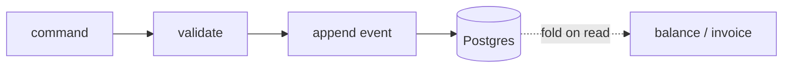

Event sourcing has a reputation for being a five-headed architecture monster. Most of
that reputation comes from people pairing it with full CQRS read-model splits they
never needed. We adopted event sourcing for our billing core and *consciously skipped*
the split. Eighteen months later, here's the scorecard.

## The setup

Billing is the one place where "what happened" matters more than "what is." Every
dispute, refund, and proration is a question about history. Event sourcing makes
history the source of truth instead of a side effect.



We store events in one Postgres table and fold them on read. No separate read store,
no eventual-consistency window, no second database to operate.

```sql
-- one append-only table is the entire write model
CREATE TABLE billing_events (
  stream_id   uuid        NOT NULL,
  version     int         NOT NULL,
  event_type  text        NOT NULL,
  payload     jsonb       NOT NULL,
  occurred_at timestamptz NOT NULL DEFAULT now(),
  PRIMARY KEY (stream_id, version)        -- optimistic concurrency for free
);
```

## What we gained

- **Replayable audit** — every balance is provable from first principles
- **Time-travel debugging** — fold the stream to any point and inspect
- **Trivial corrections** — append a compensating event, never mutate the past

## What we deliberately skipped

CQRS tells you to split reads and writes into separate models and stores. For a
five-engineer team serving sub-30ms queries, that split buys complexity we can't
afford. We fold on read, cache the snapshot, and move on.

:::note Snapshots, not splits
When folding got slow on long streams, we added periodic snapshots — a cached fold up
to version N. Reads start from the snapshot and replay the tail. This gave us 95% of
CQRS's read performance for 5% of its operational cost.
:::

> The point of event sourcing isn't to be fancy. It's that "what happened" is a
> better source of truth for money than "what is." Skip the parts that don't serve
> that goal.

A single Postgres still serves every billing query under 30ms p99. We were told that
was impossible without the split. It wasn't.
