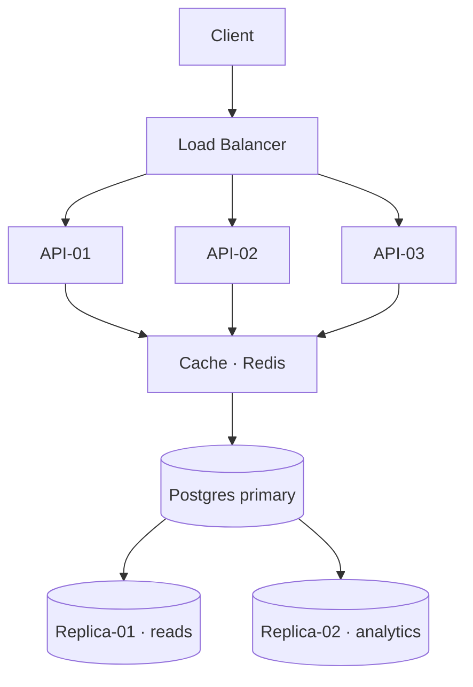
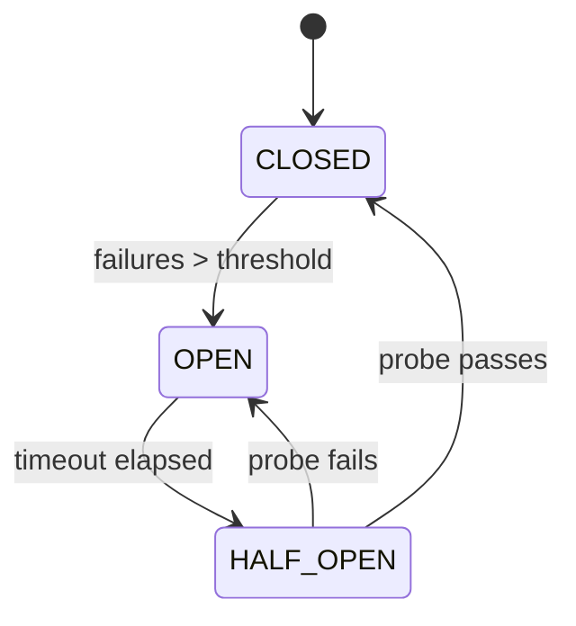
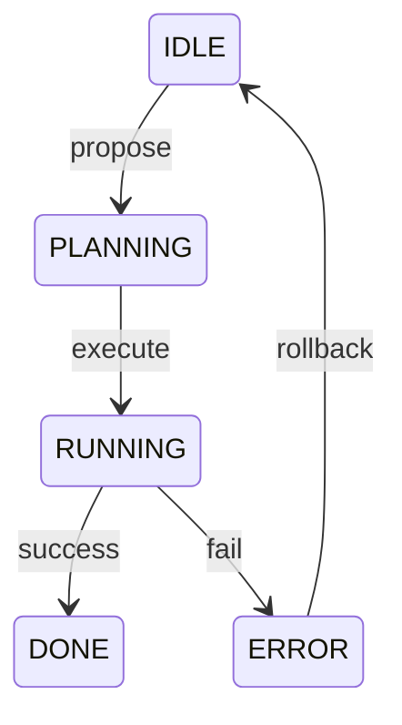

# Systems Engineering: A Complete Reference

This is a *comprehensive* test document covering every element this blog renderer supports. It exists to validate **typography**, spacing, code highlighting, callouts, images, diagrams, and reading comfort at scale. Every block type appears at least once; most appear multiple times with variation.

---

## Part I — Typography Fundamentals

### 1.1 The Prose Baseline

Body text should read at a comfortable density. Paragraphs establish rhythm. After reading two or three paragraphs you should not feel fatigued — the line length, leading, and font weight should conspire to let the eye sweep left-to-right without tracking effort.

Every word should earn its place. **Bold** signals importance; it should be used sparingly so it retains meaning. *Italic* provides emphasis without weight — good for technical terms on first use, or for a phrase that would carry stress in speech. `inline code` distinguishes symbol names from prose without requiring a full code block.

The quick brown fox jumps over the lazy dog. Sphinx of black quartz, judge my vow. Pack my box with five dozen liquor jugs. How vexingly quick daft zebras jump. The five boxing wizards jump quickly. Back in my quaint garden, jaunty zinnias vie with flaunting phlox.

#### 1.1.1 Inline Elements

This paragraph tests every inline element simultaneously. **Bold text** breaks in the middle of a sentence, followed by *italic emphasis*, then `monospace code`, then a [link to somewhere](https://example.com), and finally back to normal prose weight — the transition should be smooth and never jarring.

Testing **nested *emphasis* inside bold** and `code with symbols: fn main() { }` and longer inline code like `pub async fn handle(req: Request<Body>) -> Result<Response<Body>>` which should wrap gracefully within the paragraph.

#### 1.1.2 Paragraph Rhythm

Six paragraphs in a row, all the same weight and size, should feel *even*. The spacing between them should be consistent — not tighter after a heading, not looser before the next section. If the rhythm breaks, something in the margin/padding math is off.

Paragraph two of the rhythm test. Lorem ipsum dolor sit amet, consectetur adipiscing elit, sed do eiusmod tempor incididunt ut labore et dolore magna aliqua. Ut enim ad minim veniam, quis nostrud exercitation ullamco laboris nisi ut aliquip ex ea commodo consequat.

Paragraph three. Duis aute irure dolor in reprehenderit in voluptate velit esse cillum dolore eu fugiat nulla pariatur. Excepteur sint occaecat cupidatat non proident, sunt in culpa qui officia deserunt mollit anim id est laborum.

Paragraph four. The measure — characters per line — sits at roughly 70 to 80 for this column width. That is the classical sweet spot for reading comfort in Latin script. Shorter lines cause the eye to saccade too often; longer lines lose the return-to-left-margin position.

Paragraph five. **Mixing weights** within a paragraph is a real-world case. A sentence with *several* different `inline` elements should still maintain a consistent baseline. The interline spacing must not expand where inline elements are taller than the x-height.

Paragraph six. The final paragraph before the next section heading. The space between this paragraph and the upcoming h3 heading should be notably larger than inter-paragraph spacing — signalling a structural transition, not just a new thought.

---

## Part II — Heading Hierarchy in Full

### 2.1 Second-Level Headings

The h2 heading above introduces a major section. It carries an accent-color pixel square to its left and a bottom rule. The space above should be generous — this is a chapter-level break.

### 2.2 Third-Level Headings

The h3 heading is a teal subsection header with a smaller pixel square. Less vertical space above — it is a subdivision, not a full reset. Read the sequence h2 → body → h3 → body as a natural hierarchy.

### 2.3 Consecutive Subsections

Two or more h3 headings close together should not feel cramped. The space below the preceding body and above the new heading must breathe even when there is no body text between them.

### 2.4 A Fourth Subsection at h3

Four h3 headings in one h2 section validates that the geometry does not break down at scale. The accent square should be consistent across all of them.

#### 2.4.1 Fourth-Level Headings

H4 is the smallest named division. No geometric marker — just uppercase mono tracking and a subdued color. Good for sub-paragraphs or named procedures within a step.

#### 2.4.2 Another H4

Two consecutive h4 headings should read as a flat list of named items, not a wall of uppercase. The vertical margin above carries the weight.

#### 2.4.3 A Third H4

And a third, to confirm three consecutive h4 headings remain legible and distinct from each other and from body text below.

---

## Part III — Lists

### 3.1 Unordered Lists

Unordered lists use a pixel square bullet aligned to the cap-height of the first line. Multi-line items should keep the bullet on line one.

- First item in the list — short and clear
- Second item, slightly longer to see the gap between the bullet and the text column
- Third item with **bold emphasis** inside the list item, which should not disrupt the leading
- Fourth item with `inline code` — monospace inside a list item at the correct baseline
- Fifth item that is deliberately quite long so we can see how the text wraps past the bullet character and stays indented correctly across multiple lines of content in the list body, which is a real-world case in technical documentation

### 3.2 Ordered Lists

Ordered lists use leading-zero mono counters aligned to the right margin of the gutter.

1. Initialize the database connection pool with a minimum of 4 and maximum of 32 connections
2. Run the schema migration inside a transaction — roll back on any error, never leave partial state
3. Warm the cache by issuing shadow reads against the 1,000 most-queried keys before traffic arrives
4. Bring the service into the load balancer rotation only after health checks pass for 10 consecutive seconds
5. Enable write traffic in 5% increments, watching p99 latency and error rate at each step before proceeding
6. If any gate fails, automated rollback fires — no human decision required in the critical path

### 3.3 Mixed Content in Lists

Lists often contain mixed content. Here is a list where each item includes a code term and a sentence of explanation.

- `SIGTERM` — the polite shutdown signal; the process should finish in-flight work and exit cleanly within 30s
- `SIGKILL` — the impolite signal; the kernel tears down the process immediately; no cleanup is possible
- `SIGHUP` — historically "hangup"; now widely used to tell a daemon to reload its configuration without restarting

---

## Part IV — Block Quotes

> The most important property of a program is whether it accomplishes the intention of its user.

A short standalone quote breathes on both sides. The left accent rule is the visual anchor.

> Distributed systems are not about computers talking to each other. They are about coping with the *fact* that computers fail, networks partition, and clocks lie — and building useful services anyway.
>
> The uncomfortable truth is that every distributed system either handles these failures explicitly or pretends they don't exist and gets bitten eventually. There is no middle ground; there is only acknowledged uncertainty and unacknowledged uncertainty.

A multi-paragraph quote keeps the rule continuous. The italic weight distinguishes it from body without requiring a different color.

> Premature optimisation is the root of all evil. But so is premature pessimisation. The engineer's job is to understand the critical path before touching it — not to assume it is fine, and not to assume it is broken.

---

## Part V — Code Blocks

### 5.1 Rust — Async Resource Pool

```rust
// Async resource pool with backpressure and graceful drain.
use tokio::sync::{Semaphore, OwnedSemaphorePermit};
use std::sync::Arc;

pub struct Pool<T: Send + 'static> {
    inner: Arc<PoolInner<T>>,
}

struct PoolInner<T> {
    sem:   Semaphore,
    items: tokio::sync::Mutex<Vec<T>>,
}

impl<T: Send + 'static> Pool<T> {
    pub fn new(items: Vec<T>) -> Self {
        let n = items.len();
        Pool { inner: Arc::new(PoolInner {
            sem:   Semaphore::new(n),
            items: tokio::sync::Mutex::new(items),
        })}
    }

    /// Acquire one resource; waits if the pool is exhausted.
    pub async fn acquire(&self) -> PoolGuard<T> {
        let permit: OwnedSemaphorePermit =
            Arc::clone(&self.inner.sem)
                .acquire_owned()
                .await
                .expect("semaphore closed");
        let item = self.inner.items.lock().await.pop().unwrap();
        PoolGuard { item: Some(item), pool: Arc::clone(&self.inner), permit }
    }
}
```

### 5.2 Python — Async Paginator

```python
import asyncio
from typing import AsyncIterator

async def paginate(
    client,
    endpoint: str,
    page_size: int = 100,
) -> AsyncIterator[dict]:
    """Yield records from a paginated API — backpressure via async iteration."""
    cursor = None
    while True:
        params = {"limit": page_size}
        if cursor:
            params["cursor"] = cursor

        resp = await client.get(endpoint, params=params)
        resp.raise_for_status()
        body = await resp.json()

        for record in body["data"]:
            yield record  # caller controls flow via async for

        cursor = body.get("next_cursor")
        if not cursor:
            break  # exhausted

async def main():
    async with httpx.AsyncClient() as client:
        async for record in paginate(client, "/api/v2/events"):
            await process(record)
```

### 5.3 SQL — Skew-Aware Aggregation

```sql
-- Window the heavy tenant separately and union back.
WITH tenant_vol AS (
    SELECT
        tenant_id,
        SUM(bytes_transferred) AS total_bytes,
        COUNT(*)               AS event_count
    FROM   transfer_events
    WHERE  created_at >= NOW() - INTERVAL '24 hours'
    GROUP  BY tenant_id
),
ranked AS (
    SELECT *,
           NTILE(100) OVER (ORDER BY total_bytes DESC) AS pct_rank
    FROM   tenant_vol
)
SELECT
    tenant_id,
    total_bytes,
    event_count,
    CASE
        WHEN pct_rank <= 1  THEN 'whale'
        WHEN pct_rank <= 10 THEN 'heavy'
        ELSE 'standard'
    END AS traffic_tier
FROM  ranked
ORDER BY total_bytes DESC
LIMIT 500;
```

### 5.4 Bash — Deployment Script

```bash
#!/usr/bin/env bash
set -euo pipefail

IMAGE="${REGISTRY}/${SERVICE}:${BUILD_SHA:-latest}"
NAMESPACE="${K8S_NAMESPACE:-production}"

echo "pulling ${IMAGE}"
docker pull "${IMAGE}"

echo "running smoke tests"
docker run --rm "${IMAGE}" /app/bin/smoke-test \
    --endpoint "${SMOKE_URL}" \
    --timeout  30s

echo "deploying to ${NAMESPACE}"
kubectl set image deployment/"${SERVICE}" \
    app="${IMAGE}" \
    --namespace "${NAMESPACE}"

# Wait for rollout — fail fast if it stalls
kubectl rollout status deployment/"${SERVICE}" \
    --namespace "${NAMESPACE}" \
    --timeout   300s

echo "done"
```

### 5.5 JavaScript — Retry with Exponential Backoff

```javascript
// Exponential backoff with full jitter — prevents thundering herd on recovery.
async function withRetry(fn, { maxAttempts = 5, baseMs = 200 } = {}) {
    for (let attempt = 0; attempt < maxAttempts; attempt++) {
        try {
            return await fn();
        } catch (err) {
            if (attempt === maxAttempts - 1) throw err;
            // Full jitter: random sleep between 0 and 2^attempt * baseMs
            const cap    = Math.pow(2, attempt) * baseMs;
            const jitter = Math.random() * cap;
            await sleep(jitter);
            console.warn("attempt", attempt + 1, "failed, retrying in", jitter.toFixed(0), "ms");
        }
    }
}

const sleep = (ms) => new Promise((r) => setTimeout(r, ms));
```

---

## Part VI — ASCII Diagrams

### 6.1 Request Flow



### 6.2 Circuit Breaker States



### 6.3 Agent Lifecycle



---

## Part VII — Images

### 7.1 Architecture Diagram


### 7.2 Performance Graph


### 7.3 Flame Graph


### 7.4 Dashboard Screenshot


---

## Part VIII — Callouts

### 8.1 Note

:::note Background context
The pattern described in this section requires Postgres 13 or later. Earlier versions lack `SKIP LOCKED` on `FOR UPDATE`, which is the entire mechanism that makes this work safely under concurrent load. On Postgres 12, the lock dance produces phantom reads.
:::

### 8.2 Warning

:::warn Do not do this in production
Setting `max_connections = 1000` without tuning `shared_buffers`, `work_mem`, and the kernel's `fs.file-max` will exhaust OS file descriptors long before Postgres uses all its connection slots. Your service will silently start refusing new connections with a cryptic "too many open files" error at 3am.
:::

### 8.3 Tip

:::tip Rule of thumb
Start with `max_connections = 4 × CPU_cores` and a pool sized to half that. Measure under real load. Most OLTP applications need fewer than 20 connections per replica — a pool hides the surge.
:::

---

## Part IX — Horizontal Rules

Use `---` to separate major thematic breaks within a section. The rule should be subtle — a visual pause, not a hard stop.

First thematic section. This text sits above the first rule. The rhythm should continue smoothly after the rule — reading does not stop, it merely pauses.

---

Second thematic section. The gap above and below the rule should be generous enough to signal a section boundary without chopping the page into disconnected slabs. The tri-dot glyph is the separator.

---

Third thematic section. Three consecutive rules confirm the renderer handles multiples without collapsing or compounding the spacing. This paragraph terminates the rule test.

---

## Part X — A Very Long Section

### 10.1 Memory Models

Modern CPUs do not execute instructions in the order you wrote them. Neither does the compiler emit code in that order. Neither does the cache coherence protocol propagate writes in that order. The *memory model* of a language defines what guarantees you get despite all of this reordering.

In Rust, the atomics API exposes these guarantees directly: `SeqCst`, `Acquire`, `Release`, `AcqRel`, and `Relaxed` correspond to the C++20 memory orderings. Getting them wrong produces data races that the type system cannot catch — because these are *intentional* uses of unsafe-equivalent semantics inside safe Rust.

The rule of thumb: use `SeqCst` until you understand why you need something weaker, then benchmark before you change it. Premature optimisation of memory orderings is a category of bug that takes days to reproduce in a test harness and minutes to cause data corruption in production.

#### 10.1.1 Acquire/Release Pairs

The most common pattern is an `Acquire` load paired with a `Release` store. A mutex is exactly this: the unlock is a `Release` store that publishes all writes made while holding the lock; the next lock is an `Acquire` load that reads all those writes.

```rust
use std::sync::atomic::{AtomicBool, Ordering};

static READY: AtomicBool = AtomicBool::new(false);

// Thread A: producer
fn producer(data: &mut u64) {
    *data = 42;
    READY.store(true, Ordering::Release); // publish the write to data
}

// Thread B: consumer
fn consumer(data: &u64) -> u64 {
    while !READY.load(Ordering::Acquire) {
        core::hint::spin_loop();
    }
    *data // safe: Acquire sees everything before the Release
}
```

#### 10.1.2 Relaxed Loads

Relaxed ordering provides no synchronization guarantees — only atomicity. It is appropriate for counters that do not gate any other memory access: metrics, hit counts, statistics. Using Relaxed for a flag that guards a data structure is undefined behaviour.

#### 10.1.3 Sequential Consistency

`SeqCst` provides a single total order across all `SeqCst` operations on all threads. It is the strongest guarantee and typically the most expensive on weakly-ordered ISAs (ARM, POWER). On x86, which is already strongly ordered, `SeqCst` stores compile to a locked exchange and cost about the same as `Release`.

### 10.2 Latency Percentiles

Latency is not normally distributed. Averages hide the tail. Your p50 can be excellent while your p99 is alarming your largest customers — because the tenants hitting the slow path are exactly the ones with the largest data sets, longest sessions, or most complex queries.

The *shape* of the distribution matters as much as the level. A bimodal distribution that averages to 40ms might have a 4ms fast path and a 400ms slow path. The average tells you nothing useful about either.

> Report p50, p95, p99, and p999. Report max only if you also report the sample window — a max without a window is meaningless. Never report only the average to an on-call engineer; it actively obscures the problem.

Histograms are more honest than percentile summaries. A histogram retains the shape; a percentile summary discards it. If your metrics system allows it, store histograms and compute percentiles at query time. HdrHistogram, Prometheus native histograms, and DDSketch all trade off accuracy, memory, and mergeability differently — pick the one that matches your query latency, not the one with the prettiest dashboard.

### 10.3 Connection Pooling

Every database connection is a file descriptor, a kernel socket buffer pair, a backend process (in Postgres), and a shared memory segment reference. The overhead is non-trivial. A service that opens a connection per request will saturate the database's connection capacity long before it saturates the database's query capacity.

The correct model is a bounded pool. Each application instance holds between `min_size` and `max_size` persistent connections. Requests borrow from the pool; if exhausted, they queue or fail fast. The pool pre-validates idle connections with a lightweight ping before handing them out.

```python
# asyncpg pool — correct configuration for a high-throughput service
import asyncpg

async def create_pool() -> asyncpg.Pool:
    return await asyncpg.create_pool(
        dsn="postgresql://user:pass@db:5432/mydb",
        min_size=4,          # always keep 4 warm connections
        max_size=20,         # never open more than 20 per instance
        max_inactive_connection_lifetime=300,  # evict idle after 5m
        command_timeout=30,  # kill queries that run longer than 30s
        server_settings={
            "application_name": "my-service",
            "jit": "off",    # disable JIT for OLTP
        },
    )
```

With 5 application replicas and `max_size=20`, the maximum Postgres connection count is 100. A PgBouncer in transaction mode can reduce this further: each application connection maps to a database connection only while a query is executing, multiplying the effective connection capacity by `1 / avg_query_duration_in_seconds`.

### 10.4 Circuit Breakers

A circuit breaker wraps a downstream call and tracks its failure rate over a sliding window. When the failure rate exceeds a threshold, it trips and starts failing calls immediately — without even attempting the downstream request — until a probe interval passes and a test call succeeds.

The circuit breaker prevents a slow or failing downstream from consuming your thread pool, exhausting your connection pool, and propagating the failure upstream through cascading timeouts rather than fast errors.

:::warn Beware of mis-tuned thresholds
A circuit breaker that trips on a 5% error rate during a brief network hiccup will cause more damage than the original downstream issue. Tune the window size and threshold against the real failure signatures of your dependencies — not theoretical values from a tutorial.
:::

### 10.5 The Four Golden Signals

Google's SRE book names four signals that together describe the health of any service:

1. **Latency** — how long requests take, and specifically how long *failed* requests take (a slow error is worse than a fast one)
2. **Traffic** — the volume of demand: requests per second, messages per second, bytes per second
3. **Errors** — the rate of failed requests; 5xx rates tell a different story than 4xx rates
4. **Saturation** — how "full" the service is: CPU utilisation, memory pressure, queue depth, connection pool exhaustion

Each signal should have a dashboard pane, an alerting threshold, and — critically — an SLO. Alerts that fire without SLO context are noise; alerts that fire on SLO burn rate are signal.

### 10.6 Database Indexing Fundamentals

An index is a data structure that allows the database to find rows without scanning the entire table. The most common type is a B-tree, which supports equality, range, and sort operations in O(log n) time. A hash index supports only equality in O(1) but cannot range-scan.

The cost of an index is the write amplification it introduces: every INSERT, UPDATE, and DELETE must also update every index on the table. A table with 12 indexes pays 12x write overhead on every mutation. Index aggressively on read-heavy tables; index conservatively on write-heavy ones.

```sql
-- Covering index: includes all columns needed by the query
-- so Postgres can satisfy the query from the index alone (index-only scan)
CREATE INDEX CONCURRENTLY idx_events_tenant_time_covering
    ON transfer_events (tenant_id, created_at DESC)
    INCLUDE (bytes_transferred, status)
WHERE status != 'cancelled';  -- partial index: skip rows we never query
```

The `CONCURRENTLY` keyword builds the index without holding a write lock on the table — essential on production tables with ongoing traffic. The partial index predicate reduces the index size by excluding rows that never appear in the query's WHERE clause.

#### 10.6.1 Index Bloat

Postgres uses MVCC: old row versions are not deleted immediately. They accumulate until VACUUM reclaims them. Index entries for dead tuples are not reclaimed during a normal index scan — they persist until VACUUM processes the index. On write-heavy tables, indexes bloat faster than the heap.

Monitor index bloat with `pgstatindex`; rebuild bloated indexes with `REINDEX CONCURRENTLY` during low-traffic windows.

#### 10.6.2 Query Planning

The query planner chooses an execution plan based on table statistics. Stale statistics lead to bad plans: a planner that thinks a table has 1,000 rows when it has 10,000,000 will choose a sequential scan when an index scan would be 1,000x faster.

Run `ANALYZE` regularly. Set `autovacuum_analyze_scale_factor = 0.01` on large tables so autovacuum triggers after 1% of rows change, not the default 20%.

---

## Part XII — Tables & Task Lists

### 12.1 Pipe Tables

Tables render on the terminal glass with a box-drawing grid. The header row carries the phosphor accent; alignment markers in the separator row are honored.

| Signal     | Source                | Threshold      | Owner   |
|------------|-----------------------|---------------:|:-------:|
| Latency    | histogram, p99        | > 250ms        | app     |
| Traffic    | requests per second   | > 12,000 rps   | infra   |
| Errors     | 5xx ratio over 5m     | > 0.5%         | app     |
| Saturation | pool wait time        | > 50ms         | infra   |

A second, smaller table checks that `inline code` and **bold** survive inside cells:

| Flag              | Default | Effect                          |
|-------------------|---------|---------------------------------|
| `jit`             | on      | disable for OLTP — **always**   |
| `synchronous_commit` | on   | relax only for ephemeral data   |

### 12.2 Task Lists

Rollout checklist — completed items strike through and dim:

- [x] Provision replicas and verify replication lag < 5s
- [x] Ship dual-write behind a feature flag
- [ ] Backfill historical rows in 10k batches
- [ ] Flip reads to the new table for 1% of tenants
- [ ] Delete the old write path

---

## Part XI — Wrapping Up

### 11.1 Checklist

All elements tested in this document:

- Heading levels: # (h1), ## (h2), ### (h3), #### (h4)
- Paragraph body text with correct leading and measure
- **Bold emphasis**, *italic emphasis*, and `inline code`
- Unordered list with pixel-square bullet
- Ordered list with leading-zero counter
- Mixed-content list with code terms and prose
- Blockquote with left accent rule
- Multi-paragraph blockquote
- Fenced code blocks: Rust, Python, SQL, Bash, JavaScript
- ASCII diagram blocks: request flow, circuit breaker, state machine
- Image placeholder blocks with captions
- Callouts: note, warn, tip
- Horizontal rules (multiple in sequence)
- Very long prose sections for reading-comfort validation

### 11.2 Final Thought

> Good design is not about adding things. It is about removing everything that is not necessary, and then being ruthless about the line between necessary and nice-to-have.

A reader who finishes this document and wants to keep reading has confirmed the typography works. A reader who feels fatigued has not.
