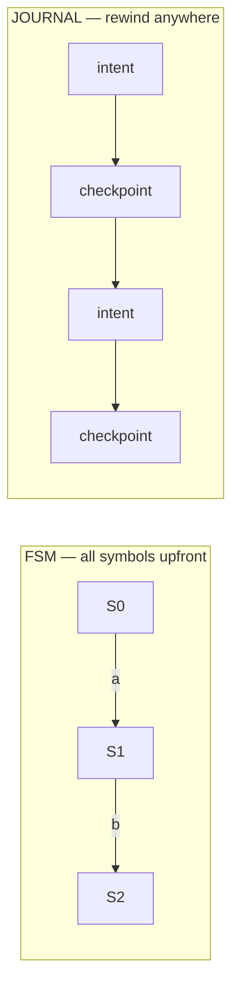

Strict finite state machines assume you know the next symbol. With LLM-driven agents,
you don't — the alphabet is "whatever the model said this time." So we stopped
modelling agents as FSMs and started modelling them as *journals*.

## Why the FSM breaks

A classic FSM has a transition table: state + symbol → next state. That works when the
symbol set is finite and known. An agent's next action is sampled, not enumerated, so
the table has infinite columns.



## Intent + checkpoint instead of transitions

We replaced the transition table with two primitives: an **intent** (what the agent
wants to do) and a **checkpoint** (a snapshot it can return to). The agent can retry,
branch, or roll back without corrupting downstream state.

```python
def step(agent, state):
    checkpoint = snapshot(state)          # cheap, content-addressed
    intent = agent.propose(state)         # may be anything
    try:
        return apply(intent, state)
    except InvalidTransition:
        return restore(checkpoint)        # roll back, let the agent retry
```

## Branching is a feature, not a bug

Because every checkpoint is immutable, exploring two strategies is just two folds from
the same point. We keep the winning branch and discard the rest.

- **Retry** — restore the last checkpoint, resample the intent
- **Branch** — fork from a checkpoint, run strategies in parallel
- **Roll back** — return to any prior snapshot, no compensation needed

:::note The mental shift
Stop asking "what state am I in?" Start asking "what's the journal of intents that got
me here, and where can I rewind to?" Determinism comes from the *log*, not the
transitions.
:::

> Agents are not automata. They're explorers. Give them a map they can rewind, not a
> track they can derail from.
