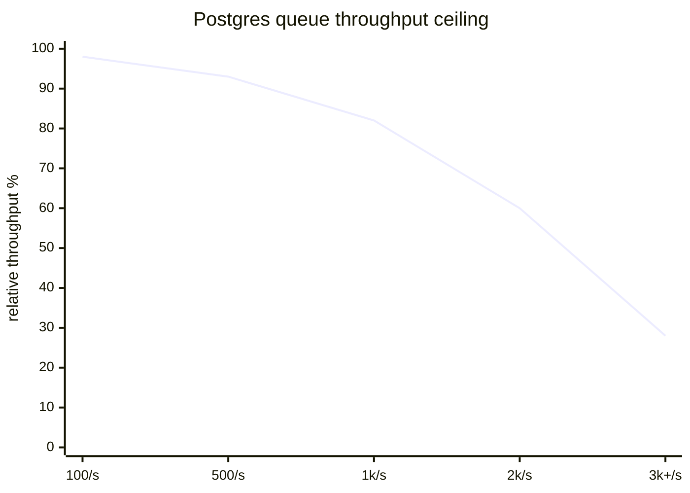

Yes, we ran a job queue on Postgres. Yes, it used `FOR UPDATE SKIP LOCKED`. No, you
should not be proud of it — but you also shouldn't be ashamed. Here's the honest
account.

## The embarrassing query

This is the whole queue. One table, one query, three years of production traffic.

```sql
-- claim the next job without blocking other workers
UPDATE jobs
SET status = 'running', claimed_at = now()
WHERE id = (
  SELECT id FROM jobs
  WHERE status = 'pending'
  ORDER BY created_at
  FOR UPDATE SKIP LOCKED          -- the magic words
  LIMIT 1
)
RETURNING *;
```

`SKIP LOCKED` lets each worker grab a different row without contending. It is, frankly,
elegant for something so improvised.

## Where it actually hurt

- **Vacuum pressure** — high-churn rows mean dead tuples, mean autovacuum sweat
- **Visibility lag** — `pg_stat` makes a poor dashboard for queue depth
- **No native delays** — scheduled jobs meant a `run_after` column and a polling loop



## The day we migrated (and the teams that didn't)

At roughly 3,000 jobs/sec the vacuum tuning stopped being a side quest and became a
full-time job. That was the day we moved to a real broker. But four other teams stayed
on Postgres and are completely fine — their volume never crossed the line.

:::note The actual advice
Don't reach for Kafka on day one. `SKIP LOCKED` will carry you further than you think.
Migrate when the *operational* cost of the queue exceeds the cost of running a broker —
not a moment before.
:::

> The best queue is the one you already operate. For three years, that was Postgres.
> It owed us nothing and it served us well.
