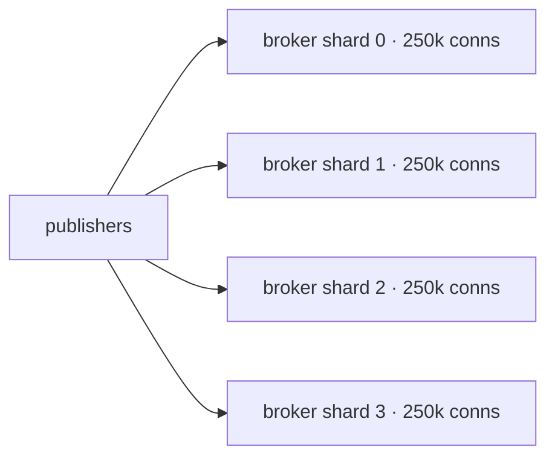

A million concurrent WebSocket connections sounds like a hardware problem. It's
mostly a *defaults* problem. Here is how we got there without melting the fleet.

## The budget that matters

At a million connections, every byte per connection is a megabyte of RAM. We started
by auditing the per-connection memory budget and cutting it ruthlessly.



## Kernel knobs that actually move the needle

Most "tune your kernel" posts list fifty sysctls. Three of them mattered:

```bash
# accept queue depth — the silent connection dropper
net.core.somaxconn = 65535
# reuse sockets stuck in TIME_WAIT under churn
net.ipv4.tcp_tw_reuse = 1
# raise the ephemeral port ceiling for outbound broker links
net.ipv4.ip_local_port_range = 1024 65535
```

- `somaxconn` — too low and you drop connections during reconnect storms
- `tcp_tw_reuse` — without it, churn exhausts your sockets
- ephemeral port range — the ceiling you hit at exactly the worst time

## Backpressure: drop the slow, save the fleet

The failure mode that takes down a cluster isn't load — it's one slow consumer
buffering gigabytes while the broker tries to be polite. The policy is simple: bound
the per-connection send buffer, and when it overflows, *drop the consumer*, not the
broker.

```rust
// bounded channel per connection; overflow = disconnect, not backlog
let (tx, rx) = mpsc::channel(256);
if tx.try_send(frame).is_err() {
    metrics::slow_consumer_dropped();
    conn.close(CloseCode::Policy);     // protect the shared broker
}
```

:::warn The one rule
A slow consumer is the cluster's problem only if you let it be. Bound every buffer.
Drop without apology. The 999,999 healthy connections will thank you.
:::

> We hit 1.04M connections on the same fleet that previously capped at 180k. We
> changed no hardware. We changed defaults and one backpressure policy.
