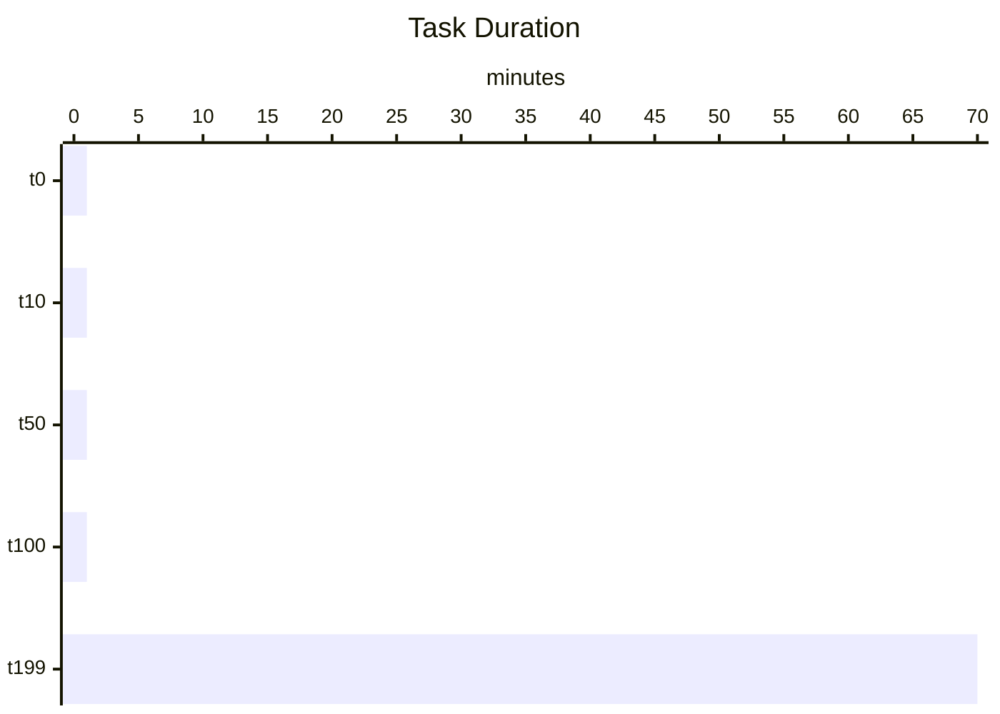

The Spark UI showed the classic skew portrait: two hundred tasks finished in minutes,
one straggler still grinding an hour later. A single tenant owned most of the join
key space. Here's how to fix it — in the right order.

## Reading the skew

Skew always looks the same in the timeline: a wall of short tasks and one bar that
runs off the edge of the screen.



## Step 1 — let AQE try first

Adaptive Query Execution can split skewed partitions automatically. Always turn it on
before reaching for manual tricks.

```scala
spark.conf.set("spark.sql.adaptive.enabled", true)
spark.conf.set("spark.sql.adaptive.skewJoin.enabled", true)
// AQE splits oversized partitions at runtime based on real stats
```

## Step 2 — broadcast, but know the cliff

If one side fits in memory, broadcast it and skip the shuffle entirely. The danger is
broadcasting something that *almost* fits — it explodes driver memory.

:::warn The broadcast cliff
Broadcast joins are free until they aren't. Set
`spark.sql.autoBroadcastJoinThreshold` deliberately and watch driver memory. A
broadcast that OOMs the driver is slower than any shuffle.
:::

## Step 3 — salt the hot key

When one key dominates, spread it across N synthetic partitions by salting, join, then
collapse. This reshapes the distribution without lying to your metrics.

```scala
val salted = skewed.withColumn("salt", (rand() * 16).cast("int"))
val exploded = dim.withColumn("salt", explode(array((0 until 16).map(lit): _*)))
salted.join(exploded, Seq("key", "salt"))   // hot key now spread 16 ways
```

- AQE first — it's free and often enough
- Broadcast second — when one side genuinely fits
- Salt last — the heavy hammer, only for truly pathological keys

> The 10TB job went from 71 minutes to 9. The data didn't change. The *shape* of the
> work did.
