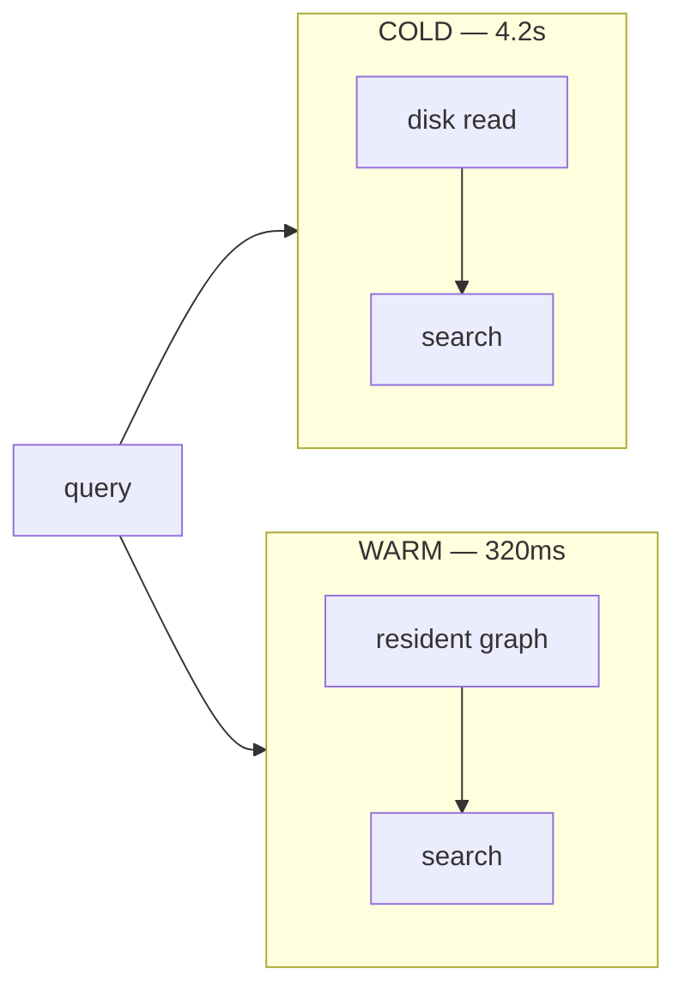

Cold queries against a frozen ANN index pegged our p95 at 4.2 seconds. Users felt
every millisecond of it. Three changes brought p95 to 320ms with no infra change.
Here's the breakdown.

## Why cold starts hurt vector search

An HNSW index is useless until it's resident in memory. The first query after a deploy
or scale-up pays to page the entire graph off disk — and that first query is often a
real user, not a warm-up.



## Change 1 — warm pools tied to query rate

Instead of a fixed pool, we size warm replicas to recent query rate. When traffic
climbs, replicas pre-warm *before* they take traffic.

```python
def target_warm_replicas(qps: float) -> int:
    # one warm replica per 500 qps, floor of 2, ceiling of 32
    return max(2, min(32, math.ceil(qps / 500)))
```

## Change 2 — preloaded graphs in shared memory

We load the HNSW graph into a shared memory segment once, then map it read-only into
every worker. New workers attach instead of re-reading from disk.

- One copy of the graph per host, not per worker
- New workers are warm in milliseconds, not seconds
- Deploys no longer cause a cold-start stampede

## Change 3 — shadow queries during deploys

Before a replica takes live traffic, we replay a sample of recent queries against it.
By the time it's in rotation, its caches are hot and its graph is resident.

:::note Result
p95 went from **4.2s → 320ms** — a 92% cut — without adding a single node. The index
was never the problem. *Coldness* was.
:::

> Latency work is rarely about doing less work. It's about doing the work *before* the
> user shows up.
